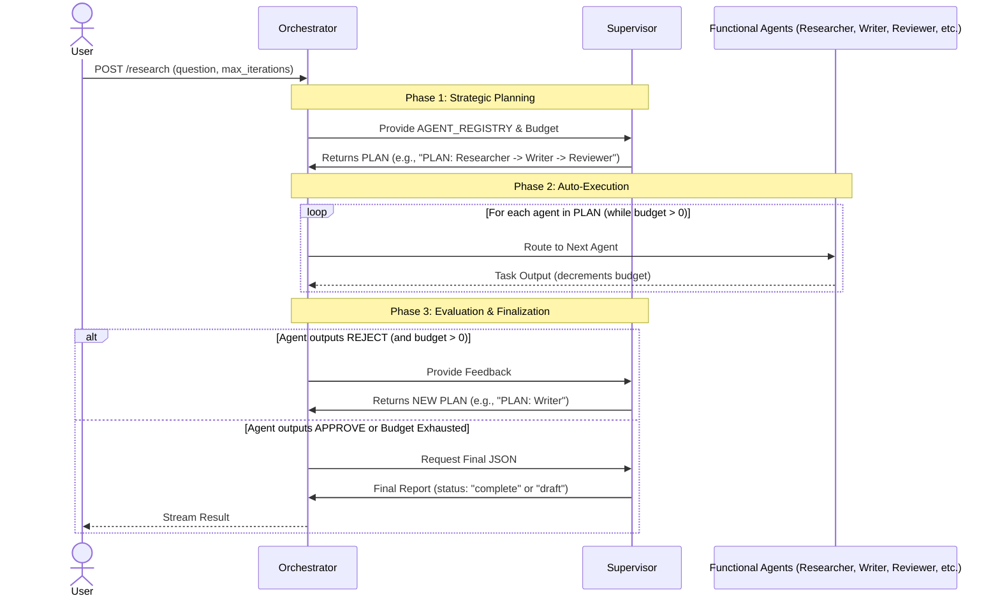

# Research Assistant API (AutoGen + Gemini)

This project implements an AI-powered Research Assistant using **Microsoft AutoGen**, **Google Gemini**, and **FastAPI**.
It features a multi-agent system (Researcher, Writer, Reviewer, Supervisor) orchestrated to produce high-quality research reports.

## Features
- **Multi-Agent Orchestration**: Specialized agents for gathering, writing, and reviewing.
- **Iterative Workflow**: Research -> Write -> Review -> Refine loop.
- **Real-time Streaming**: Server-Sent Events (SSE) for live agent progress updates.
- **Configurable**: Adjustable depth, format, and iterations.

## How it Works

The system uses a flexible, plan-ahead orchestration model to manage the multi-agent workflow efficiently without exceeding the iteration budget:



### Key Concepts
- **Dynamic Registry**: Adding a new agent is as simple as defining it in the `AGENT_REGISTRY`. The Supervisor automatically discovers it and can include it in its plans.
- **Budget Awareness**: The Supervisor actively manages the `max_iterations`. If the budget is low (e.g., `2`), it will skip optional agents (like the Reviewer) and output a shorter plan (e.g., `PLAN: Researcher -> Writer`) to ensure a draft is completed.
- **Auto-Execution**: Once a plan is set, the Orchestrator routes messages between functional agents automatically, saving time and LLM costs by skipping redundant Supervisor checks.

### Robustness and Reliability
- **Session Timeouts**: Each research session has a configurable `timeout` (default 300 seconds). If the session exceeds this, the system enters "Salvage Mode." The Supervisor attempts to compile a "draft" report from partial findings, ensuring no work is completely lost.
- **Intelligent Retries**: If any functional agent (Researcher, Writer, Reviewer) returns an empty, incomplete, or error-like response, the Orchestrator automatically retries that agent's turn once. If the second attempt also fails, the Supervisor is alerted to make a new plan or finalize a draft.
- **Comprehensive Logging**: A standardized logging system (using Python's `logging` module) is integrated. Every key event, retry, timeout, and error is logged with context for full traceability and easier debugging.
- **LLM API Resilience**: The underlying LLM calls (Gemini API) are configured with `max_retries` and `timeout` settings to handle transient network issues or rate-limiting gracefully.
- **Client Disconnect Handling**: If a client disconnects during an active streaming session, the Orchestrator detects the cancellation and terminates the background AI tasks to prevent unnecessary API costs.

## Prerequisites

- Python 3.9+
- Google Cloud API Key (for Gemini)

## Setup

1. **Install Dependencies**:
   ```bash
   python3 -m pip install -r requirements.txt
   ```

2. **Configure Environment**:
   - Rename `.env` (or create one) and add your Google API Key:
     ```
     GOOGLE_API_KEY=your_actual_api_key
     ```
     (A `.env` file with a placeholder has been created for you).

## Running the API

Start the server:
```bash
python3 -m uvicorn src.app.main:app --reload
```

## Usage

### Endpoint: `POST /research`

Starts a research session. Returns a Server-Sent Events (SSE) stream.

**Request Body:**

```json
{
  "question": "Research topic here",
  "depth": "brief" | "detailed" | "technical",
  "max_iterations": 5,
  "report_format": "essay" | "bullet_points" | "table",
  "timeout": 300
}
```

**Response Stream:**

The stream yields JSON events:

1.  **Progress Updates**:
    ```json
    {"type": "progress", "message": "Researcher has started gathering information..."}
    ```
    ```json
    {"type": "progress", "message": "Researcher has completed their step.", "preview": "Partial content..."}
    ```

2.  **Final Result**:
    ```json
    {
      "type": "result",
      "data": {
        "final_report": "The markdown or JSON report content...",
        "conversation_history": [
          {
            "agent": "Researcher",
            "role": "user",
            "content": "Full text of what the agent said..."
          },
          ...
        ],
        "metadata": {
          "iterations": 5,
          "model": "gemini-2.5-flash"
        }
      }
    }
    ```

**Example Request**:
```bash
curl -N -X POST http://localhost:8000/research \
  -H "Content-Type: application/json" \
  -d '{
    "question": "Explain the differences between RAG and fine-tuning for LLMs",
    "depth": "detailed",
    "max_iterations": 5,
    "report_format": "essay"
  }'
```

## Running Tests

We have a comprehensive test suite covering unit, integration, and end-to-end (E2E) scenarios.

### Running All Tests (Unit, Integration, E2E)
To run all tests, including the live E2E tests which require a valid `GOOGLE_API_KEY`, use the following command:

```bash
RUN_E2E=1 GOOGLE_API_KEY=your_actual_api_key python3 -m pytest -v
```

### Running Fast Tests (Unit and Integration Only)
For quick feedback during development, you can run only the unit and integration tests (which use mocks and do not hit the live API):

```bash
python3 -m pytest tests/unit tests/integration -v
```

### Running End-to-End (E2E) Tests Separately
E2E tests verify the full system with live API calls. They are skipped by default. To run them:

```bash
RUN_E2E=1 GOOGLE_API_KEY=your_actual_api_key python3 -m pytest tests/e2e -v
```

### Project Structure
- `src/app/agents/`: Individual agent definitions (Researcher, Writer, Reviewer, Supervisor).
- `src/app/core/orchestrator.py`: AutoGen GroupChat and streaming logic.
- `src/app/main.py`: FastAPI application.
